```mermaid
flowchart TD
    subgraph "Private Network (Internal)"
        subgraph "NAT Router"
            NAT[NAT Table<br/>Internal IP:Port ↔ Public IP:Port]
        end
        
        PC1[PC1: 192.168.1.10:54321] --> NAT
        PC2[PC2: 192.168.1.11:12345] --> NAT
        PC3[PC3: 192.168.1.12:8080] --> NAT
    end
    
    subgraph "Public Internet"
        ISP[ISP Router]
        WebServer[Web Server: 93.184.216.34:80]
        GameServer[Game Server: 8.8.8.8:27015]
    end
    
    NAT --> ISP
    ISP --> WebServer
    ISP --> GameServer
```

#### Static NAT
**NAT** is used to translate addresses in IPv4 to a fixed public IP address, this extends the use of the limited IPv4 range as only every modem needs 1 address and internally a household or company can use a private IP range.

#### Dynamic NAT
Most private providers use this, it functions the same as Static NAT, just that the Public IP is assigned Dynamically from a pool of available addresses and rotates every so often.

#### Overloading NAT
**PAT (Port Address Translation)** is used to map many private IPs to a single Public IP address using different Ports.

