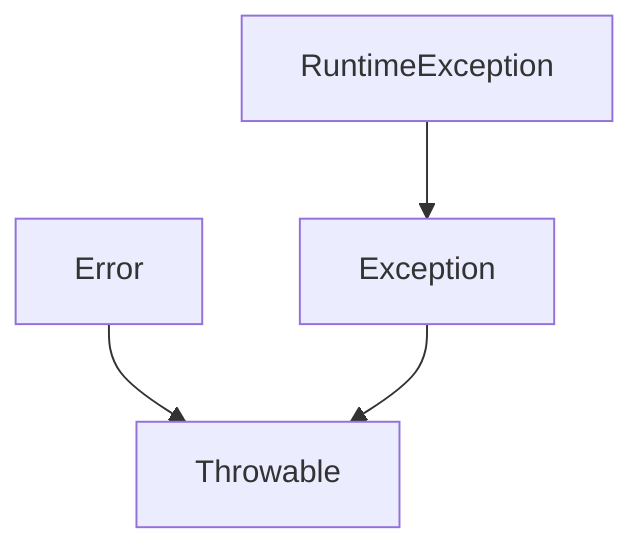

Exceptions are used to catch errors in the program and visualize them to the user.
Prominent exceptions contain, but are not limited to:

| Name                           | Description                                    |
| ------------------------------ | ---------------------------------------------- |
| ArithmeticException            | Division with zero                             |
| NullPointerException           | Referencing null                               |
| ArrayIndexOutOfBoundsException | Array access is outside of array               |
| ClassCastException             | Object does not have the type of the down-cast |
You can extend a class to **throw** an exception:
`throw exceptionReference;`

```Java
String clip(String s) throws Exception { //User should know that this exception can occur
	if (s == null) {
		throw new Exception("String is null");
	}
	if (s.length() < 2) {
		throw new Exception("String is too short");
	}
	return s.substring(1, s.length()-1);
}
```
This stops the current code and exits the method.

All possible (except unchecked) Exceptions have to be addressed in the `throw` statement.
`throws ExceptionType1, ExceptionType2`

Exceptions can be implemented with try blocks:
```Java
try {
	… regular code …
} catch (Exception e) {
	… error handling …
}
```
if in the regular code there is any error it skips instantly to the catch block.


With unchecked exceptions there is also no throw statement needed.
