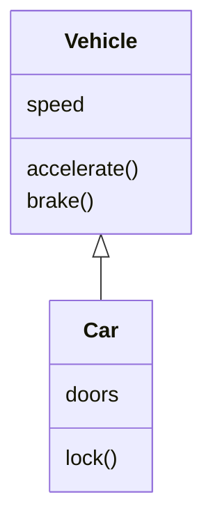
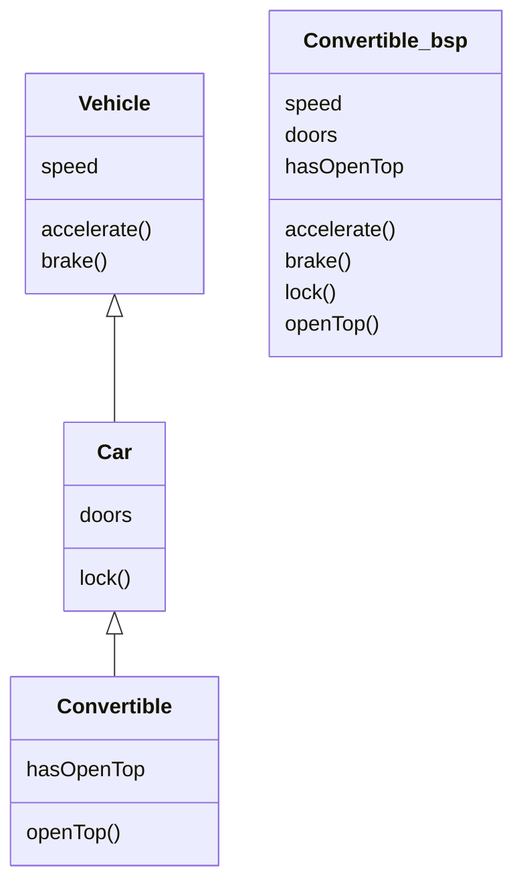
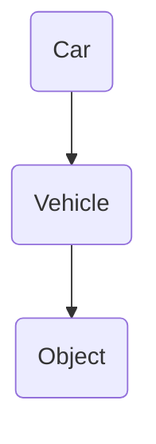

### Vererbung
***



Vererbung ist eine "is a" Beziehung.
	*A Car is a Vehicle*
	
```Java
class Vehicle {
int speed = 0;
void accelerate() { speed = 80; }
void brake() { speed = 0; }
}
class Car extends Vehicle {   //hier sieht man Car extends Vehicle
int doors = 5;
void lock() {
System.out.print("locked");
}
}
```

* Subklasse erbt von allen Superklassen
* Subklasse bietet alles, was Superklasse bietet und eventuell mehr



Alle Klassen erben von Object `class Vehicle extends Object` aber ~~extends object~~.

```Java
public class Vehicle {
	private int speed;
	public Vehicle(int speed) {               //variable speed
		this.speed = speed;
	}
}
public class Car extends Vehicle {
	private int doors;
	public Car(int speed, int doors) {
		super(speed);                         //um die variable zu nutzen: super
		this.doors = doors;
	}
}
```


### Typ-Polymorphismus
***
###### Polymorphismus
****
* Griechisch für Vielgestaltigkeit
	* Hinter dem gleichen Namen (Klasse, Methode) können sich
      unterschiedliche Dinge befinden

Ein Auto ist auch ein Fahrzeug und ein Objekt
```Java
Car c = new Car();
Vehicle v = new Car();
Object o = new Car();
```

