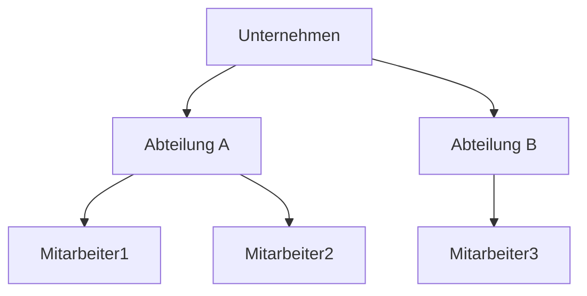
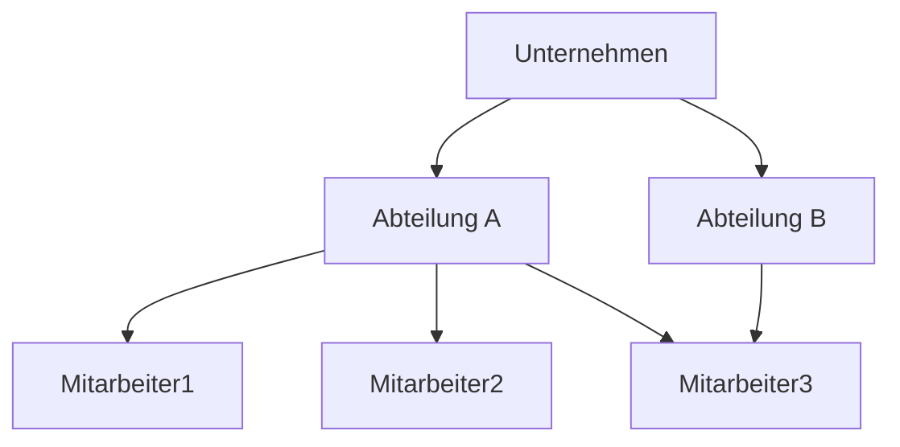
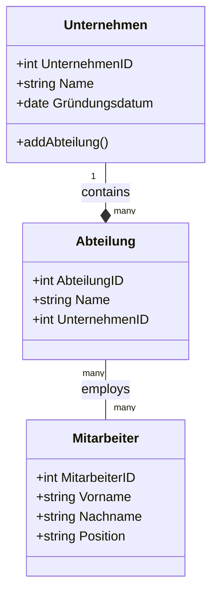

#### Hierarchisches Modell

JSON, XML
#### Netzwerk Modell

Graph-DBMS
#### Relationales Modell

| Number | Name   | City       | Nationality | Age |
| ------ | ------ | ---------- | ----------- | --- |
| 1      | Silas  | Rapperswil | CH          | 20  |
| 2      | Jannik | Zürich     | CH          | 21  |
| 3      | Fynn   | Wettswil   | CHI         | 20  |
| 4      | Dylan  | Männedorf  | USA         | 23  |
| 5      | Sara   | Zürich     | CH          | 22  |

#### Objektrelationales Model

