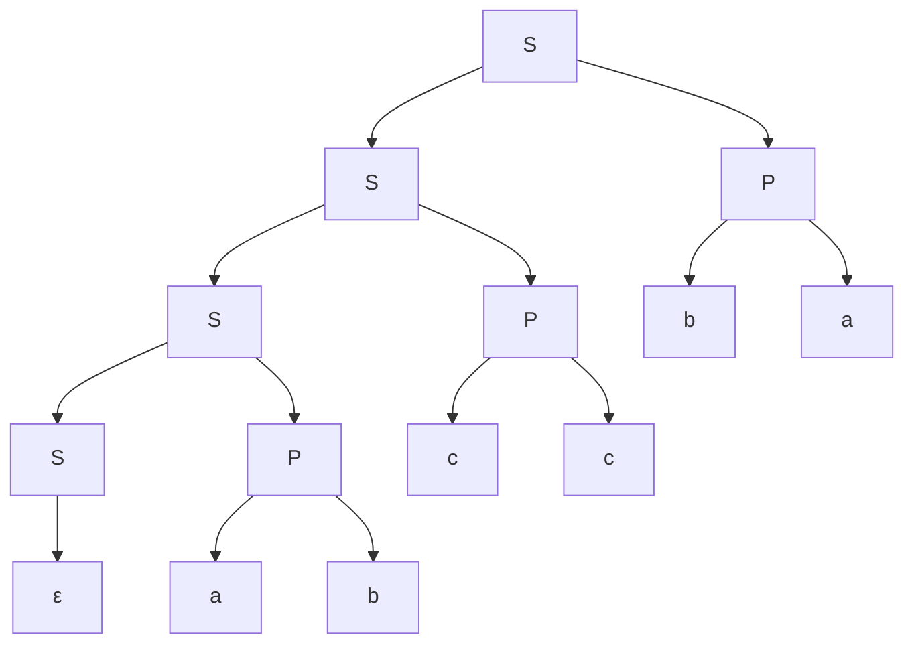

## Klammerausdrücke
- Der einfachste Klammerausdruck: $\epsilon$
- Bereist erzeugte Ausdrücke einklammern: 
	$\epsilon\rightarrow (\epsilon)= ()$
	$()\rightarrow {\color{red}(}(){\color{red})}$
	$(())\rightarrow {\color{red}(}(()){\color{red})}$
	$()(())\rightarrow {\color{red}(}()(()){\color{red})}$
- Regeln:
	$K=$ Variable für korrekten Klammerausdruck:
	$K\rightarrow\epsilon$
	$K\rightarrow (K)$
	$K\rightarrow KK$
- Von aussen Her aufbauen

#### Aufgabe
Gegeben sind die Regeln:
$S \rightarrow SS$ 
$S \rightarrow a$
$S\rightarrow bb$
$S\rightarrow ccc$

Leiten Sie damit die folgenden Wärter aus den Variablen S ab.
a) abbaccc
b) cccabba

a)
1. Verdoppeln
2. Verdoppeln
3. S zu a
4. S zu a
5. S zu bb
6. S zu ccc
$S\rightarrow SS\rightarrow SSS\rightarrow SSSS\rightarrow aSSS\rightarrow aSaS\rightarrow abbaS\rightarrow a bb a ccc$

#### Kontextfreie Grammatik
$G=(V,\sum,R,S)$
- V: Variablen
- $\sum$: Terminalsymbole (Alphabet)
- R: Regeln der Form $A \rightarrow x_1x_2...x_n$ mit $A \in V, x_i \in V \cup \sum$
- S: Startvariable

#### Aufgabe
Wörter gerader Länge $\sum = \{a,b,c\}$
$V=S$
$\sum = \{a,b,c\}$
$R=$ $\{S\rightarrow \epsilon, S\rightarrow SZZ, Z\rightarrow a|b|c, Z\rightarrow b,\}$

#### Aufgaben
$S \rightarrow \epsilon$
$S\rightarrow SP$
$P\rightarrow ZZ$
$Z\rightarrow a|b|c$

$S\rightarrow SP \rightarrow SZZ \rightarrow SZZZZ\rightarrow SZZZZZZ \rightarrow \epsilon ZZZZZZ \rightarrow abccba$ 
$S\rightarrow SP \rightarrow SZZ \rightarrow SZZZZ \rightarrow SZZZZZZ \rightarrow SZZZZZZZZ \rightarrow \epsilon ZZZZZZZZ \rightarrow ccccccaa$

$S_1\rightarrow S_1P|\epsilon$
$S \rightarrow ZZ$
$Z\rightarrow 0|1$
$S_2\rightarrow 0S_21$

a) $L=L_1L_2=\{w\in \sum^*||w| \text{ gerade und w endet mit } 0^n1^n, n\geq 0\}$
$\color{red}S_0\rightarrow S_1S_2$

b) $L=L_2^*=\{0^{n_1}1^{n_1}0^{n_2}1^{n_2}...0^{n_n}1^{n_n}|n_1 \geq 0 \forall i \geq l\}$ 
$\color{red}S_0\rightarrow S_0S_1$
$\color{red}S_0\rightarrow \epsilon$

$S \rightarrow S+S$
$S\rightarrow S-S$
$S \rightarrow Z$
$Z \rightarrow 7|5|2$

### Chomsky normalform
1. Keine Unit-rules $A \rightarrow B$
2. Keine Regeln $A \rightarrow \epsilon$ ausser wenn nötig $S\rightarrow\epsilon$
3. Keine Regeln mit mehr als $2$ Variablen auf der rechten Seite
4. Genauer: rechte Seite enthält genau zwei Variablen oder genau ein Terminalsymbol

Oder
1. Neue Start variable $S_0 \rightarrow S$ (wenn nötig)
2. $\epsilon$-Regeln $\begin{cases}A \rightarrow \epsilon \\B\rightarrow AC \end{cases}\implies$ A kann weg gelassen werden $\implies \begin{cases}B \rightarrow AC \\B\rightarrow C \end{cases}$ 
3. Unit Rules $\begin{cases}A \rightarrow B \\B\rightarrow CD \end{cases}\implies$ aus A kann man wie aus B auch CD machen $\implies\begin{cases}A \rightarrow CD \\B\rightarrow CD \end{cases}$ 
4. Verkettung: $A\rightarrow u_1u_2...u_n$ ersetzt durch $A \rightarrow u_1A_1, A_1\rightarrow u_2A_2,...,A_{n-2}\rightarrow u_{n-1}u_n$ und falls $u_i$ ein Terminalsymbol ist: $A_{i-1}\rightarrow U_iA_i, U_i\rightarrow u_i$

