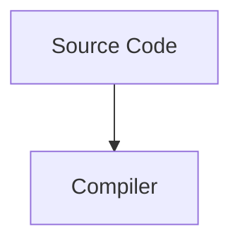
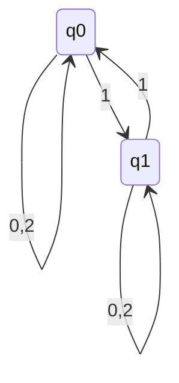
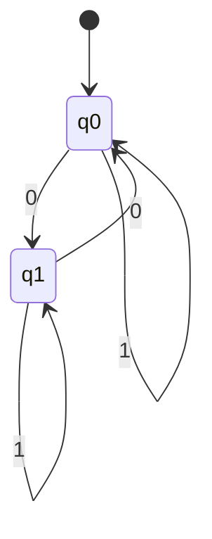

**Eine Sprache ist eine Menge von Zeichenketten.**

##### Deterministischer Endlicher Automat (DEA)
Ein Pfeil für jedes Zeichen in jedem Zustand
$A = ({\color{red}Q},{\color{lightblue}\sum},{\color{green}\delta},q_0{\color{orange}F})$
- Alphabet $\color{lightblue}\sum$
- Übergangsfunktion $\color{green}\delta$ : $Q\times \sum \implies Q$
- Startzustand $q_0 \in Q$
- Akzeptierzustände $\color{orange}F$ $\subset Q$

|                                       | $\color{lightblue}0$ | $\color{lightblue}1$ |
| ------------------------------------- | -------------------- | -------------------- |
| $\color{red}q_0$                      | $\color{green}q_2$   | $\color{green}q_1$   |
| ${\color{red}q_1}  / \color{orange}F$ | $\color{green}q_0$   | $\color{green}q_1$   |
| ${\color{red}q_2}/\color{orange}F$    | $\color{green}q_1$   | $\color{green}q_2$   |

CPU ist ein endlicher Automat

**Achten auf:**
- Klar bezeichneter Startpunkt
- Für jeden Zustand einen Pfeil

Bei $\sum =\{0,1,2\}$
$L = \{w\in\sum^*|\text{w ist eine ungerade Zahl im Dreiersystem}\}$

Startpunkt ist $q_0=0=\text{leeres Wort}$ 
- wenn man $0\text{ und } 2$ addiert bleibt es immer im gleichen Zustand
- wenn man $1$ addiert geht es in den anderen Zustand

**Rekonstruieren**
$\sum = \{0,1\}$
$L = \{w\in\sum^*||w|_0 \text{gerade}\}$
- $Q=\{L=(w)|w\in\sum^*\}$
- $q_0=L(\xi) = L$
- $F= \{L(w)\in Q|\xi \in L(w)\}$
- $\delta (L(w),a) = L(wa)$

| $w$   | $L(w)$                                         | $Q$   |
| ----- | ---------------------------------------------- | ----- |
| $\xi$ | $L(\xi)=L$                                     | $q_0$ |
| 0     | $L(0)=\{w\in\sum^*\|\|w\|_0 \text{ungerade}\}$ | $q_1$ |
| 1     | $L(1)=\{w\in\sum^*\|\|w\|_0 \text{gerade}\}=L$ | $q_0$ |
| ...   | ...                                            | ...   |

#### Minimalautomaten
WIEDERHOLEN!!!!
