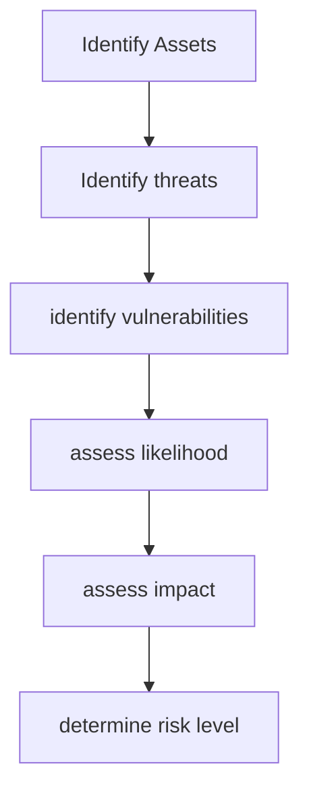

### Information Security Management System (ISMS)
A Structured framework used to systematically manage and protect an organizations assets through various policies, processes and controls.

#### Key Terms

| Term              | Description                                                                                  |
| ----------------- | -------------------------------------------------------------------------------------------- |
| policy            | instructions that dictate certain behavior within an organization                            |
| guidelines        | non-mandatory recommendations employees may use as a reference                               |
| procedures        | step-by-step instructions designed to assists employees in following policies                |
| practices         | examples of actions that illustrate compliance with policies                                 |
| standard          | a detailed statement of what must be done to comply with a policy                            |
| de jure standard  | a standard that has been formally evaluated and approved by a formals standards organization |
| de facto standard | a standard that is widely adopted or accepted by a public group                              |
### Threat analysis
**Identify Assets -> Identify threats -> identify vulnerabilities -> assess likelihood -> assess impact -> determine risk level**

#### Classifying Assets
- Public - Information shared without risk
- Internal - Information for organization internal use only
- Confidential - Sensitive information that could cause harm if disclosed
- Restricted - Highly sensitive, strictly limited and strongly protected information

