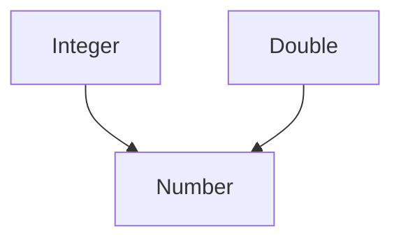
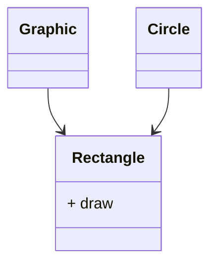

#### Generisches Programmieren
```Java
public class Box<T> {
private T object;
```
`T` = Typ-Parameter

Deklaration
```Java
Box<String> stringBox = new Box<>();
String value = stringBox.pop();
Box<Integer> integerBox = new Box<>();
```
Typprüfung zur Compilezeit
```Java
stringBox.push(23); // Fehler
integerBox.push("Hello"); // Fehler
```

##### Generische Klasse
Klasse mit **generischen Typ-Parameter**
`class Box<T> {}`

**Generischer Typ**
Generische Klasse, die mit konkretem Typ instanziiert wird.
```Java
Box<String> box1;
Box<Integer> box2;
Box<Person> box3;
Box<double[]> box4;
Box<Object> box5;
```
Typ-Argument

##### Namenskonvention:
- `E` --> Element
- `K` --> Key
- `V` --> Value
- `T` --> Type
- `s,u,v` --> weitere Typen

##### Iterable and Iterator
**Iterable**
```JAva
interface Iterable<T> {
Iterator<T> iterator();
}
```

**Iterator**
```Java
interface Iterator<E> {
boolean hasNext();
E next();
}
```
Ist für alle Typen verwendbar aufgrund Generics.

##### Gemische Argumenttypen
Methoden können auch Generisch gemacht werden
```Java
public class StackTest {
public <E> Stack<E> multiPush(E value, int times) {
var result = new Stack<E>();
for (int i = 0; i < times; i++) {
result.push(value);
}
return result;
}
}
```

`Stack<String> stack1 = multiPush(100, 100)` --> gibt eine **Exception** da der Target type String ist.

```Java
private static <T extends Comparable<T>> T majority(T x, T y, T z) {
T max = x;
if (y.compareTo(max) > 0) {
max = y;
}
if (z.compareTo(max) > 0) {
max = z;
}
return max;
}
// Aufruf mit verschiedenen Typen
Integer n = majority(1, 3.141, 1)
```
Typ inferenz anderst wenn gemische Typen Übergeben werden.
`1` = Integer
`3.141` = Double
`1` = Integer

All of them are T = Number
Man sucht immer nach einem Basistyp der die Typen vereint, sprich


##### Aufgabe
Aufgabe: findLargest
• Schreibe eine generische Methode mit dem Namen findLargest, die das grösste Element
eines Iterable liefert.
• Wenn eine Klasse Iterable implementiert, kann diese in einem for-each Loop verwendet
werden.
• Die Funktion soll für Parametern mit beliebigen Typen funktionieren. Es soll möglich sein eine
Liste von String aber auch eine Liste von Integer zu übergeben.
• Mit dem Ausdruck <T extends Comparable<T>> kannst du sicherstellen, dass der Methode
nur Parameter übergeben werden die Comparable implementieren und mit compareTo
verglichen werden können.

##### Zusammenfassung
Klasse: `public class Stack<T> { /* … */ }`
Interface: `interface Iterator<E> { /* … */ }`
Methode: `public <E> Stack<E> multiPush(E value, int times) { /* … */ }`
Generische Klassen machen Typfehler schon zur laufzeit möglich
#### Type bounds


```java
class GraphicStack<T extends Graphic> extends Stack<T> {
public void drawAll() {
for (T item : this) {
item.draw();
}
}
}
```

class GraphicStack<T extends Graphic>`
• extends-Klausel bei Typ-Parameter
• Typ-Argument muss von Graphic erben
```Java
GraphicStack<Rectangle> // Ok
GraphicStack<Circle> // Ok
GraphicStack<Graphic> // Ok
GraphicStack<String> // Fehler
GraphicStack<Object> // Fehler
```

##### Java Laufzeit-Architektur
Quellcode --> Java Compiler --> Bytecode --> Java Virtual Machine

##### Type erasure
Der Compiler **Löscht** alle Generischen Informationen.
Methode muss nach Type Erasure eindeutig sein
```Java
Object majority(Object x, Object y, Object u);
<T> T majority(T x, T y, T z);
```
Methoden hätten nach Type Erasure die gleiche Signatur.

##### Einschränkungen
- Keine Instanzen von `T`
- Keine statischen Parameter vom Typ `T`
- Type-Casts zu `T` sind geprüft
- kein `new T()`
- keine primitiven Datentypen

**Generics machen coding sicherer zur Programmierzeit**
Type erasure gibt es um Java abwärtskompatibel zu machen.*Type erasure löscht alle generischen Informationen was es in älteren Java Generationen nicht gibt*
