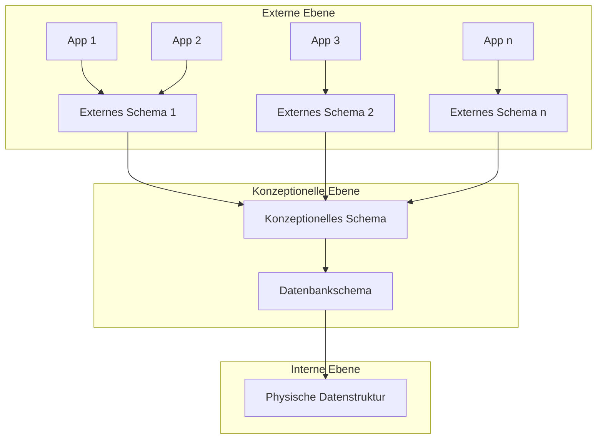

#### Externe Ebene
Ist was der Enduser sieht, sprich die Berechtigungen die er hat um in der Datenbank Daten zu sehen.

#### Konzeptionelle Ebene
Ist der Zusammenhang zwischen Realwelt und Datanbank, wird in ER-Modell dargestellt.

#### Interne Ebene

