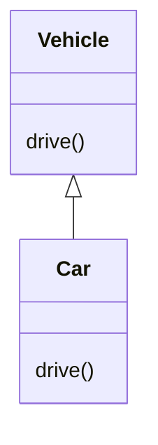

### Overloading
Gleicher Name aber unterschiedliche Parameter:
```Java
class Vehicle {
	void drive(String destination) {...}
	
	void drive(int x, int y) {...}
	
	void drive(Coordinate target) {...}
}
```

- **Rückgabetyp ist irrelevant**
- Alle überladenen Methoden müssen in derselben Klasse sein.

**f spezifischer als g, da alle möglichen Aufrufe von f auch auf g passen,
aber nicht umgekehrt.**

### Overriding
Subklasse implementiert geerbte Methode neu, Methode hat gleiche Signatur wie in
Basisklasse
```Java
class Vehicle {
	void drive() {
		System.out.print("Driving any vehicle");
	}
}
class Car extends Vehicle {
	void drive() {
		System.out.print("Driving a car");
	}
}
```



Mit Super lässt sich die Methode der Superklasse Aufrufen, sprich, wenn die klasse Car die drive Methode von Vehicle aufrufen möchte und nicht overriden, muss super.drive() geschrieben werden.

Der Dynamische Typ ist wichtiger als der Statische Typ
```Java
class Vehicle {
    void drive() { System.out.println("Vehicle driving"); }
}

class Car extends Vehicle {
    @Override
    void drive() { System.out.println("Car driving"); }
}

// Im Code:
Vehicle v = new Car();  // Statischer Typ: Vehicle, Dynamischer Typ: Car
v.drive();              // Ausgabe: "Car driving"
```

### Hiding
Statische Bindung
	• Zugriff auf Field der eigenen Klasse mit description oder this.description
	• Zugriff auf Field der Basisklasse mit super.description oder ((Vehicle)this).description
	• super.super gibt es nicht, Zugriff stattdessen mit ((SuperSuperClass)this).variable

### Equals
Regeln bei equals()
	• Reflexivität
		• x.equals(x) → true
	• Symmetrie
		• x.equals(y) == y.equals(x)
	• Transitivität
		• x.equals(y) && y.equals(z) → x.equals(z)
	• Konsistenz
		• Determinismus: Gleiche Aufrufe, immer gleiches Resultat
	• Null
		• x.equals(null) → false

### Hash-code
